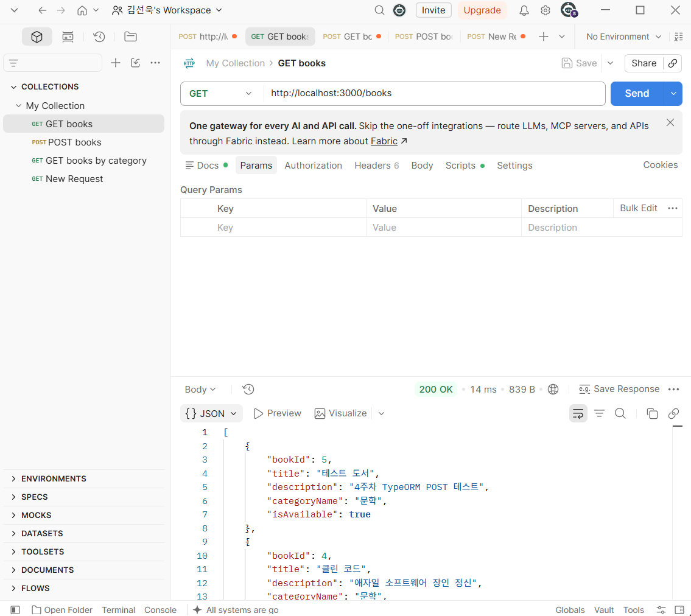
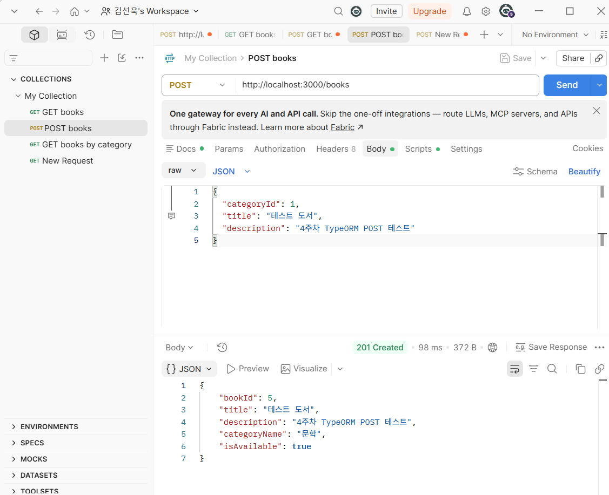
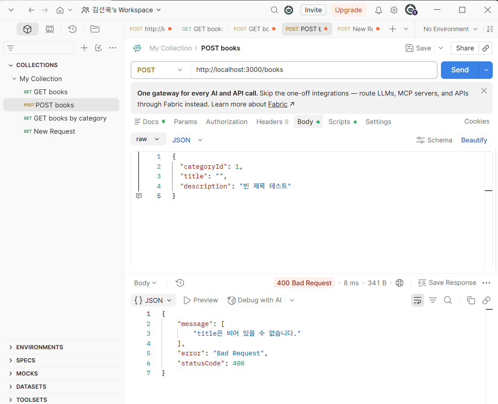

# 4주차 2번째 워크북 미니 실습 기록

## [5. [실습 1] ORM으로 도서 전체 목록 조회하기 — GET /books] 미니 실습: TypeORM 엔티티와 GET /books 최신순 조회
- 목표: 3주차 Raw SQL(`SELECT * FROM book`)을 TypeORM 엔티티·Repository로 바꾸고, 도서 목록을 최신 등록순 + 응답 DTO로 반환하기
- 변경 파일: `src/app.module.ts`, `src/books/entities/book.entity.ts`, `src/books/entities/category.entity.ts`, `src/books/dto/book-response.dto.ts`, `src/books/books.module.ts`, `src/books/books.service.ts`, `src/books/books.controller.ts` (옛 `src/book.*.ts` 삭제)
- 핵심 코드:
```ts
// book.entity.ts: book.category_id FK를 Category 객체 관계로 표현
@ManyToOne(() => Category, (category) => category.books, { nullable: false })
@JoinColumn({ name: 'category_id' })
category: Category;

@Column({ name: 'is_available', default: true })
isAvailable: boolean;

// books.service.ts: JOIN + 정렬을 SQL 대신 옵션으로
const books = await this.bookRepository.find({
  relations: { category: true },
  order: { bookId: 'DESC' },
});
return books.map((book) => BookResponseDto.from(book));
```
- 배운 점:
  - 3주차 응답은 DB 컬럼 그대로 `book_id`, `is_available: 1`(snake_case, tinyint 숫자)이었는데, 엔티티에서 `name: 'is_available'`로 매핑하고 DTO로 내보내니 `bookId`, `isAvailable: true`(camelCase, boolean)가 됨
  - 3주차엔 `category_id: 1` 숫자만 내려갔는데, `@ManyToOne` + `relations: { category: true }`로 카테고리를 함께 읽어서 `categoryName: "문학"`으로 응답함
  - ORM도 내부에서는 SQL을 실행함. `logging` 옵션으로 보면 `INNER JOIN category ... ORDER BY book_id DESC` 쿼리가 실제로 나감
  - 기존 테이블을 쓰므로 `synchronize: false`, bigint PK가 문자열 `"5"`로 오지 않게 `bigNumberStrings: false` 설정
- 확인 결과:
  - `GET http://localhost:3000/books` → `200 OK`, bookId 5 → 4 → … 최신순, 각 항목에 `categoryName` 포함, DB 컬럼명은 응답에 없음
  - 커밋 시점 타입 체크 `npx tsc -p tsconfig.build.json --noEmit` 통과
- 코드 변경 보기: [커밋 15d1cb4](https://github.com/0514swkim-web/UMC_study/commit/15d1cb4)
- 결과 화면: 

## [6. [실습 2] 신규 도서 등록하기 — POST /books] 미니 실습: CreateBookDto 검증과 POST /books 등록
- 목표: 요청 DTO로 `categoryId`·`title`을 검증하고, 카테고리 존재를 확인한 뒤 도서를 저장해 `201 Created` + 응답 DTO로 돌려주기
- 변경 파일: `src/main.ts`, `src/books/dto/create-book.dto.ts`, `src/books/books.service.ts`, `src/books/books.controller.ts`
- 핵심 코드:
```ts
// create-book.dto.ts: Service에 닿기 전에 검사
@Type(() => Number)
@IsInt({ message: 'categoryId는 정수여야 합니다.' })
categoryId: number;

@IsString({ message: 'title은 문자열이어야 합니다.' })
@IsNotEmpty({ message: 'title은 비어 있을 수 없습니다.' })
@MaxLength(100, { message: 'title은 100자 이하여야 합니다.' })
title: string;

// main.ts: 전역 ValidationPipe가 있어야 데코레이터 검증이 실제로 동작
app.useGlobalPipes(new ValidationPipe({ whitelist: true, transform: true }));

// books.service.ts: 없는 카테고리는 저장하지 않고 404
const category = await this.categoryRepository.findOneBy({ categoryId: dto.categoryId });
if (!category) throw new NotFoundException(`존재하지 않는 카테고리입니다. (categoryId: ${dto.categoryId})`);
const saved = await this.bookRepository.save(this.bookRepository.create({ category, ... }));
```
- 배운 점:
  - 3주차엔 검증이 없어서 빈 제목 `""`도 그대로 저장됐고, `categoryId`가 없거나 없는 카테고리면 DB 오류가 그대로 터져 500이 났음 → 이번엔 DTO 검증으로 400 + 이유 메시지, 없는 카테고리는 404 + 이유 메시지
  - `INSERT ... VALUES (?, ?, ?)`의 `?` 순서를 직접 맞추던 일을 `create()` + `save()`가 대신하고, 저장 후 `bookId`가 자동으로 채워진 엔티티를 돌려받음
  - 데코레이터만 붙이면 아무 일도 안 일어나고, 전역 `ValidationPipe`를 켜야 검증이 적용됨. `whitelist`는 DTO에 없는 필드를 버리고 `transform`은 body를 DTO 인스턴스로 바꿈
  - Nest의 `@Post()`는 기본 응답 코드가 201이라 따로 지정하지 않아도 됨
- 확인 결과:
  - `POST /books` `{"categoryId":1,"title":"테스트 도서","description":"4주차 TypeORM POST 테스트"}` → `201 Created`, `bookId: 5`, `categoryName: "문학"`, `isAvailable: true`
  - 빈 제목 `{"categoryId":1,"title":""}` → `400 Bad Request`, `"title은 비어 있을 수 없습니다."`
  - 없는 카테고리 `{"categoryId":999,...}` → `404`, `"존재하지 않는 카테고리입니다. (categoryId: 999)"` (curl로 확인)
  - 커밋 시점 타입 체크 `npx tsc -p tsconfig.build.json --noEmit` 통과
- 코드 변경 보기: [커밋 8d448bf](https://github.com/0514swkim-web/UMC_study/commit/8d448bf)
- 결과 화면:
  - 
  - 
