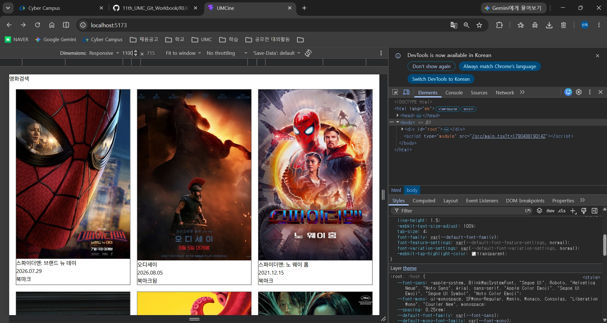
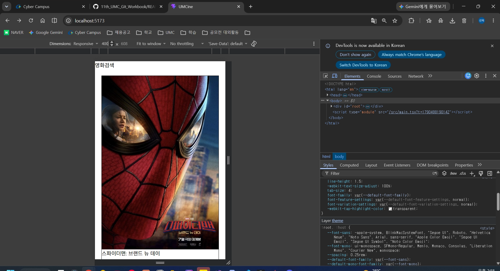

# 3주차 1번째 워크북 미니 실습 기록

## [5. 동적 라우트로 영화 상세 화면 만들기] 미니 실습: 카드에서 상세 화면으로 이동하기
- 목표: 카드의 포스터와 제목을 Link로 감싸 상세 페이지로 이동
- 변경 파일: `src/components/movies/movie-card.tsx`
- 핵심 코드:
```tsx
  <Link to="/movies/$movieId" params={{ movieId: String(movie.id) }}>
```
- 배운 점: path param은 문자열이라 `String(movie.id)`로 변환해서 전달
- 코드 변경 보기: [커밋 c936881](https://github.com/0514swkim-web/UMC_study/commit/c936881)
- 결과 화면: 

- 확인 결과: 카드 클릭 시 URL과 상세 정보 변경, 새로고침 후에도 같은 영화 유지, 없는 ID(`/movies/999`)는 안내 문구 표시


## [7. 기존 CSS를 utility class로 옮기기] 미니 실습: MovieCard 스타일 옮기기
- 목표: 인라인 스타일로 작성한 MovieCard를 Tailwind utility class로 옮기고, 반응형 그리드에서 겹치지 않는지 확인
- 변경 파일: `src/components/movies/movie-card.tsx`
- 핵심 코드:
```tsx
<article className="relative overflow-hidden rounded-[10px] border border-gray-200 bg-white shadow-sm">
  

<button
  className={cn(
    "absolute right-2 top-2 rounded-full px-3 py-1 text-xs text-white",
    movie.isBookmarked ? "bg-blue-600" : "bg-black/60",
  )}
>
```
- 배운 점:
  - `aspect-[2/3]` + `object-cover`로 원본 비율이 다른 포스터도 같은 크기로 맞출 수 있음
  - `relative`(카드) + `absolute`(버튼)로 버튼을 포스터 위에 띄움
  - `cn`으로 공통 class와 상태별 class를 구분하고, class 이름은 조립하지 않고 완성된 이름으로 작성
  - 북마크 버튼을 `Link` 밖에 두어 버튼을 눌러도 상세 페이지로 이동하지 않게 함
- 확인 결과: 400px 1열 / 768px 2열 / 1100px 3열 / 1300px 5열에서 카드 겹침 없음
- 코드 변경 보기: [커밋 1c7368a](https://github.com/0514swkim-web/UMC_study/commit/1c7368a)
- 결과 화면:
  - 데스크톱: 
  - 모바일: 