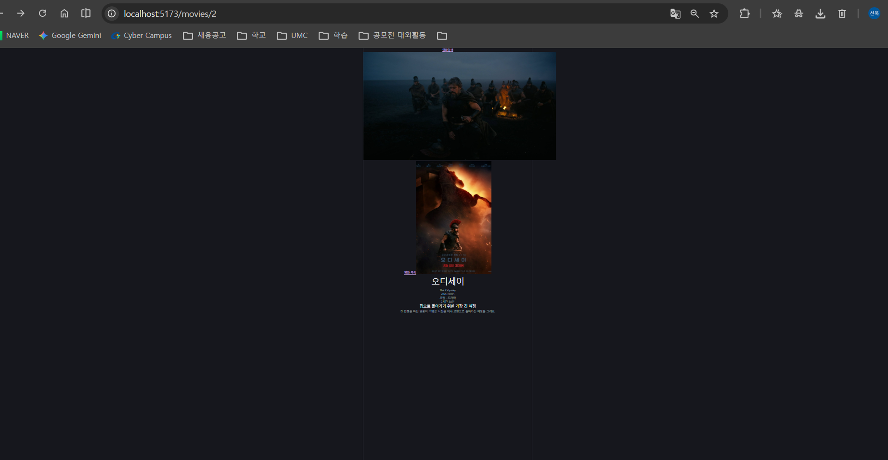

# 3주차 1번째 워크북 미니 실습 기록

## [5. 동적 라우트로 영화 상세 화면 만들기] 미니 실습: 카드에서 상세 화면으로 이동하기
- 목표: 카드의 포스터와 제목을 Link로 감싸 상세 페이지로 이동
- 변경 파일: `src/components/movies/movie-card.tsx`
- 핵심 코드:
```tsx
  <Link to="/movies/$movieId" params={{ movieId: String(movie.id) }}>
```
- 배운 점: path param은 문자열이라 `String(movie.id)`로 변환해서 전달
- 코드 변경 보기: [커밋 c936881](https://github.com/0514swkim-web/UMC_study/commit/c936881)
- 결과 화면: 