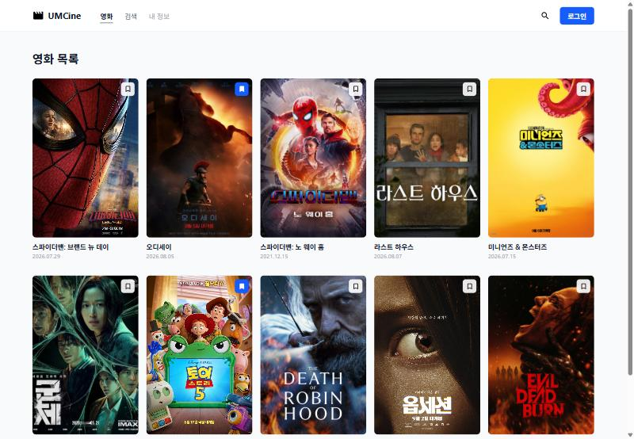

# 4주차 1번째 워크북 미니 실습 기록

## [3. 배열을 JSON 문자열로 저장하기] 미니 실습: 북마크를 새로고침 뒤에도 유지하기
- 목표: 북마크한 영화 ID 배열을 `localStorage`에 JSON 문자열로 저장하고, 새로고침 뒤에도 같은 영화가 북마크된 상태로 보이게 하기
- 변경 파일: `src/utils/bookmark-storage.ts`, `src/pages/movies/movie-list-page.tsx`
- 핵심 코드:
```tsx
// bookmark-storage.ts: 잘못된 저장값은 빈 배열로, 배열 안에서는 양의 정수만 남김
const parsedValue: unknown = JSON.parse(storedValue);
if (!Array.isArray(parsedValue)) return [];

// movie-list-page.tsx: 초기값 함수로 한 번만 읽고, 바뀔 때마다 저장
const [bookmarkedMovieIds, setBookmarkedMovieIds] = useState(() => readBookmarkIds());

const nextMovieIds = bookmarkedMovieIds.includes(movieId)
  ? bookmarkedMovieIds.filter((id) => id !== movieId)
  : [...bookmarkedMovieIds, movieId];
setBookmarkedMovieIds(nextMovieIds);
saveBookmarkIds(nextMovieIds);
```
- 배운 점:
  - Web Storage에는 문자열만 저장되므로 `JSON.stringify`로 저장하고 `JSON.parse`로 다시 배열로 읽음
  - `useState(() => readBookmarkIds())`처럼 함수를 넘기면 첫 렌더링 때만 `localStorage`를 읽음
  - 영화 객체 전체가 아니라 북마크한 **ID 배열만** 상태로 두고, `isBookmarked`는 렌더링할 때 계산함
  - 저장값은 사용자가 개발자 도구에서 바꿀 수 있으므로 `unknown`으로 받고 `try...catch`, `Array.isArray`, 타입 가드로 검사해야 함
- 확인 결과:
  - 오디세이(2), 토이 스토리 5(7)를 북마크 → value가 `[2,7]`로 저장됨
  - 새로고침 후에도 두 영화가 북마크된 상태로 유지됨
  - value를 `not-json[`으로 바꾸고 새로고침 → 화면이 오류 없이 열리고 북마크가 빈 상태로 복구됨
- 코드 변경 보기: [커밋 aa20694](https://github.com/0514swkim-web/UMC_study/commit/aa20694)
- 결과 화면: 
